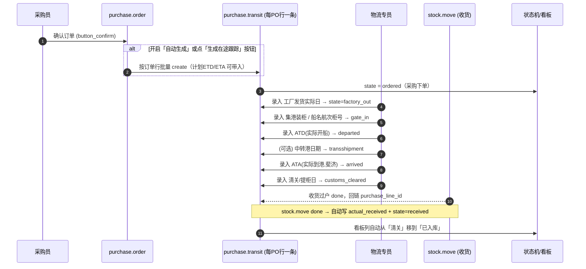
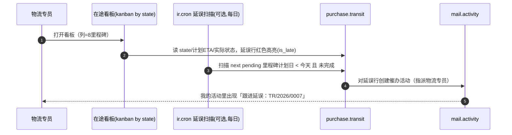

# 方案设计 — 采购在途 / 船运进度可视化模块（中国 → 斐济）

**日期**：2026-06-25
**作者**：Claude（nuclear-fusion / designing-solution）
**目标平台**：Odoo 19.0 **社区版**（self-build addon）
**跟踪粒度**：**采购订单行（`purchase.order.line`）**（用户确认）
**状态**：待评审（read-only 设计，未改任何源码）

> 纪律声明：本文档为只读方案设计，仅产出于 `docs/design/**`。实现需评审通过后交 `building-production-feature`。本设计遵循「不过度设计」——明确标注了**刻意不做**的部分（无独立船次/柜模型、无承运商 API/EDI、v1 无 Gantt）。

---

## 1. 问题定义（Problem Statement）

**一句话目标**：让采购/物流人员在 Odoo 内看到每条采购订单行从「下单」到「签收入库」的全链路物流进度（含 ETD/ETA、中转、清关），并对延误预警。

**功能范围**

*IN（本模块做）*
- 以 **PO 行**为跟踪单元，记录 8 个里程碑的**计划值 + 实际值**：采购下单 → 工厂发货 → 国内集港/装柜 → 开船 ETD → 中转港 → 到港 ETA（斐济）→ 清关/提柜 → 实际签收入库。
- 船运元数据（船名/航次/柜号/提单号/货代/起运港/目的港/贸易术语）。
- 当前状态机 + 延误标识 + 全程时长统计。
- 物流可视化（看板按里程碑分列 + ETA 日历 + 延误透视报表）。
- 与采购单（来源）、库存收货（终点自动回填）、到岸成本（可选关联）打通。
- 单据/照片附件（提单、装箱单、到货照片、货损照片）挂在跟踪记录上。

*OUT（本模块不做，刻意排除）*
- ❌ 独立的「船次 / 集装箱」聚合模型（用户选择按 PO 行跟踪，柜号等以字段形式冗余在行上即可；如后续要「一柜多 PO 行」聚合再升级，见 §11）。
- ❌ 与船公司/货代系统的 API / EDI 自动对接（v1 人工录入）。
- ❌ 报关单证生成、关税计算（清关只记录节点日期，关税走标准 `stock_landed_costs`）。
- ❌ Gantt 甘特图（`web_gantt` 为企业版；社区版用看板+日历替代）。

**非功能目标**
- 规模：单公司年采购行数量级 10³~10⁴，单表足够（无分库分表需求）。
- 一致性：强一致（同库事务，Odoo ORM 默认 REPEATABLE READ）。
- 可用性：随主实例，无独立 SLA。
- 合规/审计：里程碑日期变更需留痕（who/when/old→new），用 Odoo `tracking=True` + chatter。

**约束**
- 社区版：无 `documents`(DMS)、无 `web_gantt`、无 `stock_barcode`；可用 `mail`(chatter/activity)、`stock`、`purchase`、`purchase_stock`、`stock_landed_costs`、`product_expiry`。
- 团队技能：标准 Odoo 模块开发（Python + XML 视图）。
- 部署：随现有 Odoo 实例，单进程/多 worker 均可。

**成功标准（可度量）**
- 任一 PO 行可在 ≤1 屏看到 8 个里程碑的计划/实际值与当前状态。
- 收货过户（stock move done）后，「实际签收入库」里程碑**自动**回填，无需人工。
- 看板可按里程碑列出所有在途行；延误行（实际/预计 ETA 晚于计划）自动高亮并可触发催办。
- 报表可统计「中国→斐济平均在途天数」「ETA 准时率」。

---

## 2. 参考实现（Reference Landscape）

| 参考 | 为何可比 | 借鉴 | 不适用 |
|---|---|---|---|
| **DCSA Track & Trace 事件标准**（数字集装箱航运协会，dcsa.org，开放标准） | 国际海运里程碑的事实标准事件分类法 | 借用「每个事件分 **planned / estimated / actual** 三态」「transport event 类型（gate-in, loaded, departed/ATD, discharged, arrived/ATA）」的建模思路 → 落为本模块的 planned/actual 日期对 | 全套 EDI/JSON-API、shipment/equipment/transport-leg 多层实体对本场景过重；只取事件词汇与三态思想 |
| **Odoo 多步收货路线**（`stock` 多步路线 Supplier→Input→QC→Stock，经 transit 库位，`addons/stock/data/stock_data.xml:35` `usage=transit`） | Odoo 原生「分阶段过货」机制 | 借「实际签收入库」节点直接复用真实 stock move 完成时间（`stock.move.purchase_line_id`，`addons/purchase_stock/models/stock_move.py:15`），不重复造收货 | ETD/ETA/中转港/清关**不是 Odoo 物理库位**，无法也不应建成 transit 库位；纯日期里程碑更轻 |
| **Odoo Landed Costs**（`stock_landed_costs`，社区版存在） | PO→货物的成本归集范式 | 借「跟踪记录关联回 PO 行、可挂到岸成本」的关联模式 | 它只管成本分摊，不提供进度可视化——正是本模块补的缺口 |
| **OCA `freight_management` 系列**（社区生态，AGPL） | 同领域成熟实现 | 验证「自建轻量在途模型」是社区通行做法 | 体量大、面向货代公司（多式联运/报价/对账），与「采购方按 PO 行看进度」诉求不匹配，引入即过度设计 |

**结论**：采用 DCSA 的「planned/actual 三态里程碑」思想 + 复用 Odoo `stock.move` 完成时间做终点闭环，自建一个**轻量单表模型**，不引入货代级复杂度。

---

## 3. 实现架构（Implementation Architecture）

**架构风格**：标准 Odoo **业务 addon**（模块化单体内的一个插件）。理由——4 个需求里前 3 个已由标准模块覆盖，本模块只需新增一个领域模型 + 视图 + 与采购/库存的薄连接，符合 Odoo 「`_inherit` 非侵入扩展」范式，无需独立服务。

**部署拓扑**：无新增进程/容器，作为一个 addon 安装进现有实例。

**关键组件**

| 组件 | 职责 | 输入 | 输出 |
|---|---|---|---|
| `purchase.transit`（新模型，主） | 一条 = 一个 PO 行的在途跟踪；持有里程碑 + 船运元数据 + 状态机 | PO 行、物流专员录入、stock move 完成事件 | 状态、延误、可视化数据源 |
| `purchase.order`（扩展） | 加「生成在途跟踪」按钮 + 智能按钮（统计）+ 可选 `is_import` 标记 | 用户确认 PO | 触发批量生成 transit 记录 |
| `purchase.order.line`（扩展） | 加 `transit_ids` 反向关联 + 行内状态展示 | — | 行级在途状态 |
| `stock.move`（扩展） | done 时回填对应 transit 的「实际签收入库」 | 收货过户 | actual_received 自动写入 |
| 视图层（看板/日历/列表/透视/表单） | 物流可视化与录入 | transit 记录 | UI |
| 安全层（group + ACL + ir.rule） | 谁能看/改在途数据 + 多公司隔离 | — | 访问控制 |

**依赖图**（无环）

```
purchase_transit (本模块)
   ├─ depends → purchase_stock  (拿到 stock.move.purchase_line_id 闭环)
   │              ├─ purchase
   │              └─ stock
   ├─ depends → mail            (chatter / activity / tracking)
   └─ (可选 soft) stock_landed_costs  (到岸成本关联，非硬依赖)
```

**技术选型**（均借鉴 §2）
- 模型：标准 `models.Model` + `mail.thread` + `mail.activity.mixin`（里程碑变更留痕、附件、催办活动）——借鉴 Odoo 单据通用范式。
- 终点数据源：直接 related/compute 自 `stock.move`（borrowed from §2 参考 2），不另造收货。
- 可视化：社区版自带 Kanban + Calendar + Pivot + Graph（**不**用企业版 Gantt）。

---

## 4. 模块分层（Module Layering）

**分层模型**：Odoo 标准 MVC-ish 分层（Model 领域层 / View 表现层 / Security 访问层 / Data 配置层）。

| 层 | 目录 | 可依赖 | 不应依赖 |
|---|---|---|---|
| 领域模型 | `models/` | `purchase`,`stock`,`mail` 的模型 | 视图/控制器 |
| 表现 | `views/`（XML） | 模型字段 | 直接写 SQL |
| 访问控制 | `security/`（`ir.model.access.csv`,`res_groups.xml`,`ir_rule.xml`） | 模型、`res.groups` | — |
| 配置数据 | `data/`（`ir_sequence`,可选 `ir_cron` 延误扫描） | 模型 | — |
| 报表 | `report/`（透视/图分析视图，可选 QWeb 在途清单打印） | 模型 | — |

**横切关注点**
- 日志/审计：`mail.thread` 的 field tracking（`tracking=True`）记录里程碑日期变更。
- 配置：`res.config.settings` 加 1 个开关「PO 确认时自动生成在途跟踪」。
- 多公司：`company_id` + `ir.rule` 标准隔离。

**目录布局（建议）**

```
purchase_transit/
├── __manifest__.py          # depends: ['purchase_stock', 'mail']
├── models/
│   ├── __init__.py
│   ├── purchase_transit.py        # 主模型
│   ├── purchase_order.py          # 扩展：按钮/智能按钮/is_import
│   ├── purchase_order_line.py     # 扩展：transit_ids
│   ├── stock_move.py              # 扩展：done → 回填 actual_received
│   └── res_config_settings.py     # 自动生成开关
├── views/
│   ├── purchase_transit_views.xml # form/list/kanban/calendar/pivot/graph/search/action/menu
│   └── purchase_order_views.xml   # PO 上的按钮与智能按钮
├── security/
│   ├── res_groups.xml             # 物流专员 / 物流经理 组
│   ├── ir_rule.xml                # 多公司规则
│   └── ir.model.access.csv
├── data/
│   └── ir_sequence_data.xml       # 跟踪单号 TR/YYYY/####
└── report/
    └── purchase_transit_analysis_views.xml  # 在途分析（pivot/graph）
```

---

## 5. 核心流程（Flows）

### Flow 5.1 — PO 确认 → 生成在途跟踪 → 逐里程碑推进 → 收货闭环

**触发**：采购员确认 PO；物流专员维护里程碑；收货员过户入库。



- **端到端路径**：`purchase.order.button_confirm`(扩展) → `purchase.transit.create`（每行一条，单号取 `ir.sequence`）→ 物流专员表单录入 actual_* → `_compute_state` 推进 → `stock.move.write` done 钩子回填 `actual_received` → state=`received`。
- **数据触达**：`purchase_transit` 表、related 读 `purchase.order.line` / `stock.move`、附件 `ir.attachment`、chatter `mail.message`。
- **幂等性**：
  - 生成在途记录**幂等**——`purchase_line_id` 加 SQL `unique` 约束（一行默认一条 transit），重复点按钮只补缺失行（`create` 前先 search 去重）。
  - 收货回填**幂等**——以「该 PO 行最后一笔完成的入库 move 的完成时间」为准（覆盖式写入，多次过户取最新），非追加。
- **失败模式**：
  - PO 行无 transit 记录时收货 done → 钩子查无对应记录则跳过（不报错，记 debug 日志）。
  - 部分收货（qty_received < product_qty）→ actual_received 先按首次入库置位，state=received，但保留 `qty_received < product_qty` 的「部分」标识（计算字段 `is_partial`）。
- **时延预算**：均为交互级（人工录入/同步事务），无端到端时延 SLA。

### Flow 5.2 — 物流可视化与延误预警

**触发**：物流专员打开「在途看板」；或每日 cron 扫描延误。



- **幂等性**：cron 创建催办前先查重（同记录同类型未完成活动只建一次）。
- **降级**：cron 为可选增强；不启用时延误仅靠看板红色高亮 + 列表过滤器，仍可用。

### Flow 5.3 — 到岸成本关联（可选，soft）

收货完成后，标准 `stock_landed_costs` 录入海运费/关税并分摊到该批货物成本；transit 记录提供「这票货对应哪些 PO 行/收货单」的索引，供成本归集参考。本模块仅做**只读关联展示**（smart button 跳转），不改成本逻辑。

---

## 6. 接口与协议（Protocols）

- **对外协议**：N/A —— 纯 Odoo 后台模块，无独立对外 API。访问经标准 Web JSON-RPC（`/web/dataset/call_kw`，`odoo/http.py:2543`）与 ORM 方法，复用框架既有协议。
- **内部接口**：标准 ORM 方法 + 少量公开模型方法：
  - `purchase.order.action_generate_transit()` —— 按钮，批量生成/补齐在途记录。
  - `purchase.transit.action_advance_state(target)` —— 可选，里程碑快捷推进。
  - `stock.move._action_done()`（override 追加 super 后回填）—— 收货闭环钩子。
- **消息格式**：Odoo recordset / dict，无自定义 wire schema。
- **版本演进**：模型字段演进走 Odoo 标准——`__manifest__.py` `version` + `migrations/` 脚本；新增字段向后兼容，废弃字段保留一版再删。
- **错误模型**：复用 Odoo（`UserError`→422，`odoo/http.py:2534`）。业务校验（如 ATA 早于 ATD）抛 `ValidationError`（`@api.constrains`）。
- **契约文档**：模型即自描述（`ir.model.fields`），无需 OpenAPI。

---

## 7. 数据处理与存储（Data Handling & Storage）

**存储选型**：单一 OLTP 表 `purchase_transit`（PostgreSQL），无需 OLAP/KV/blob 专库；附件走标准 `ir.attachment`（文件存储或 DB，按实例配置）。

### 7.1 实体关系（ERD）

```mermaid
erDiagram
    PURCHASE_ORDER ||--o{ PURCHASE_ORDER_LINE : has
    PURCHASE_ORDER_LINE ||--o| PURCHASE_TRANSIT : "1:1 默认(1:N 预留)"
    PURCHASE_TRANSIT }o--|| PRODUCT_PRODUCT : tracks
    PURCHASE_TRANSIT }o--|| RES_PARTNER : "supplier / forwarder"
    PURCHASE_ORDER_LINE ||--o{ STOCK_MOVE : "purchase_line_id"
    STOCK_MOVE ..> PURCHASE_TRANSIT : "done 回填 actual_received"
    PURCHASE_TRANSIT ||--o{ IR_ATTACHMENT : "提单/装箱单/照片"
```

### 7.2 `purchase.transit` 字段表

| 字段 | 类型 | 说明 | 来源/计算 |
|---|---|---|---|
| `name` | Char | 跟踪单号 `TR/2026/0001` | `ir.sequence` |
| `purchase_line_id` | Many2one(`purchase.order.line`) | **锚点**，required，`ondelete=cascade`，index | 用户/生成 |
| `order_id` | Many2one(`purchase.order`) | related `purchase_line_id.order_id`，store | related |
| `product_id` | Many2one(`product.product`) | related，store | related |
| `partner_id` | Many2one(`res.partner`) | 供应商 related `order_id.partner_id`，store | related |
| `forwarder_id` | Many2one(`res.partner`) | 货代/物流商 | 用户 |
| `company_id` | Many2one(`res.company`) | related `order_id.company_id`，store，多公司隔离 | related |
| `product_qty` | Float | 在途数量 related `purchase_line_id.product_qty` | related |
| `qty_received` | Float | 已入库 related `purchase_line_id.qty_received` | related（`addons/purchase/models/purchase_order_line.py:65`） |
| `is_partial` | Boolean | 部分到货 compute(`qty_received < product_qty`) | compute |
| **— 船运元数据 —** | | | |
| `transport_mode` | Selection(sea/air/land) | 默认 sea | 用户 |
| `vessel_name` | Char | 船名 | 用户 |
| `voyage_no` | Char | 航次 | 用户 |
| `container_no` | Char | 柜号 | 用户 |
| `bill_of_lading` | Char | 提单号 B/L | 用户 |
| `incoterm_id` | Many2one(`account.incoterms`) | related `order_id.incoterm_id`，store | related（`addons/purchase/models/purchase_order.py:154`） |
| `pol` | Char | 起运港（默认填中国港，可改） | 用户 |
| `pot` | Char | 中转港（可空） | 用户 |
| `pod` | Char | 目的港（默认 Suva / Lautoka 斐济） | 用户 |
| **— 里程碑（planned/actual，均 Date 日粒度，tracking=True）—** | | | |
| `date_ordered` | Date | 采购下单 = related `order_id.date_approve` | related |
| `planned_factory_out` / `actual_factory_out` | Date | 工厂发货 | 用户 |
| `planned_gate_in` / `actual_gate_in` | Date | 国内集港/装柜 | 用户 |
| `planned_etd` / `actual_atd` | Date | 开船 ETD→ATD | 用户 |
| `planned_transshipment` / `actual_transshipment` | Date | 中转港（可空） | 用户 |
| `planned_eta` / `actual_ata` | Date | 到港 ETA→ATA（斐济） | 用户 |
| `planned_customs` / `actual_customs` | Date | 清关/提柜 | 用户 |
| `planned_received` / `actual_received` | Date | 签收入库（actual **自动**） | compute/钩子 |
| **— 状态与度量 —** | | | |
| `state` | Selection(8) | 当前里程碑，compute(store, readonly=False, 可手动覆写) | compute + 手动 |
| `is_late` | Boolean | 下一个未完成里程碑计划日 < 今天 | compute |
| `eta_delay_days` | Integer | `actual_ata - planned_eta`（正=延误） | compute |
| `transit_days` | Integer | `actual_received - actual_atd`（全程在途天数） | compute |
| `active` | Boolean | 归档 | — |
| `note` | Html | 备注 | 用户 |

**`state` 枚举（与里程碑一一对应）**
`ordered`(采购下单) → `factory_out`(工厂已发货) → `gate_in`(已集港装柜) → `departed`(已开船) → `transshipment`(中转中) → `arrived`(已到港) → `customs_cleared`(已清关/提柜) → `received`(已签收入库)。

`_compute_state`：取「有 actual 值的最靠后里程碑」为当前状态；中转港无值则跳过；用户可手动覆写（store + readonly=False 的标准 Odoo 可写计算字段模式）。

### 7.3 约束与索引
- `purchase_line_id` 加 `unique` SQL 约束（默认一行一条；§11 给出放开为 1:N 的迁移路径）。
- index：`purchase_line_id`、`order_id`、`state`、`planned_eta`（看板/日历/过滤高频）。
- `@api.constrains`：日期单调性校验（`actual_atd ≤ actual_ata ≤ actual_received`，缺值不校验），违者 `ValidationError`。

### 7.4 一致性 / 生命周期 / 备份
- 一致性：强一致（单库事务）。收货回填与 stock move 在同一事务内（override `_action_done` 追加），不存在跨服务最终一致问题。
- 生命周期：签收后保留作历史；`active=False` 归档；硬删除随 PO 行级联（`ondelete=cascade`）。
- 保留：随主库；无独立 TTL。
- 备份/恢复：随 Odoo 主库 PG 备份，RPO/RTO 同实例策略，无额外要求。

---

## 8. 权限控制（Access Control）

- **身份**：复用 Odoo 登录用户（session，`odoo/http.py` `Session`）；无新身份类型。
- **授权模型**：RBAC，复用并新增组：
  - `group_purchase_transit_user`（物流专员）：读写在途记录、录里程碑。
  - `group_purchase_transit_manager`（物流经理）：+ 配置、删除、看全公司。
  - 采购/库存现有组：只读在途（在 PO/收货页可见进度）。
- **最小权限矩阵**（`ir.model.access.csv`）

| 组 | read | write | create | unlink |
|---|---|---|---|---|
| 物流专员 | ✓ | ✓ | ✓ | ✗ |
| 物流经理 | ✓ | ✓ | ✓ | ✓ |
| 采购用户 | ✓ | ✗ | ✗ | ✗ |
| 库存用户 | ✓ | ✗ | ✗ | ✗ |

- **多公司隔离**：`ir.rule` —— `['|',('company_id','=',False),('company_id','in',company_ids)]`，行级隔离（Odoo 标准记录规则，由 ORM `check_access_rule` 强制，`odoo/orm/models.py:4176`）。
- **密钥管理**：N/A —— 无外部凭据/API key（v1 无对外集成）。
- **委派/越权**：N/A。

---

## 9. 安全监控与审计（Security Monitoring & Audit）

- **审计日志**：里程碑日期、船名/航次/柜号等关键字段 `tracking=True` → 变更自动入 `mail.message`（who/when/old→new），chatter 可查。满足「日期被谁改过」的留痕需求。不可篡改性：依赖 Odoo 标准 message（非 WORM/hash-chain，内部工具足够，不做监管级防篡改——**接受风险**，理由：内部采购数据非强监管对象）。
- **监控/SLI-SLO**：业务指标用透视/图视图自助分析（ETA 准时率、平均在途天数），非系统级 SLO。延误经 `is_late` + 可选 cron 催办暴露。
- **遥测**：复用平台日志（`odoo/netsvc.py:178`）；无需自建 metrics。
- **威胁模型（STRIDE）**

| 威胁 | 场景 | 缓解 |
|---|---|---|
| **S** 伪冒 | 非物流人员伪造里程碑 | RBAC 组 + session 鉴权（`auth='user'`） |
| **T** 篡改 | 偷改 ATA 掩盖延误 | `tracking=True` 留痕，chatter 可追溯 |
| **R** 抵赖 | 否认改过日期 | 同上，message 带 author/date |
| **I** 信息泄露 | 跨公司看到他司在途 | `ir.rule` company 隔离 + ACL |
| **D** 拒绝服务 | 批量生成拖垮 | 生成走 ORM 批量 create（`INSERT_BATCH_SIZE=100`），量级 10⁴ 无压力 |
| **E** 提权 | 普通用户删记录 | unlink 仅经理组 |

- **事件响应钩子**：延误 → mail.activity 催办（页内）；无需 PagerDuty 级告警。

---

## 10. 风险防控（Risk Controls）

- **滥用/防刷**：N/A（内部工具，无匿名入口）。
- **韧性**：收货回填 override `_action_done` 后置且 try/except 兜底——回填失败不阻断收货主流程（记日志，留人工补录）。这是关键设计：**物流跟踪不得影响核心收货事务成功**。
- **优雅降级**：cron 催办、看板可视化为增强项；即便不启用，列表+过滤器仍可用。
- **爆炸半径**：单表模块，最坏情况影响仅在途展示，不触及采购/库存/财务主数据（只读 related）。
- **Kill switch**：经 `res.config.settings` 关「自动生成」；模块可整体卸载而不影响 PO/收货（cascade 清理 transit 表）。
- **灰度/回滚**：先在测试库装、用真实历史 PO 验证收货回填，再上生产；回滚 = 卸载 addon（数据随 cascade 清除，PO/库存不受损）。

---

## 11. 待定问题（Open Questions）

1. **1 行 vs 1 票多行**：当前按「1 PO 行 = 1 transit（unique 约束）」。若现实中**一个柜常含一张 PO 的多行**且共享同一船名/ETD，是否需要把船运元数据上移到一个轻量「船运批次」父记录？
   - 推荐默认：**v1 保持单行**（用户已选 PO 行粒度），柜号/船名冗余在行上；提供「按柜号批量回填」的列表批操作缓解重复录入。决定因素：实际「一柜多行」占比——若 >50% 再升级父模型。
2. **里程碑粒度 Date vs Datetime**：默认 Date（日级）。若需精确到时分（如开船时刻），改 Datetime。决定因素：业务是否真用到时刻。
3. **目的港固定值**：斐济主港（Suva/Lautoka）是否做成可选 `selection` 或主数据，而非自由文本？推荐做成简单 selection，减少录入错误。
4. **是否启用每日延误 cron**：取决于是否要主动催办（vs 被动看板）。推荐启用，默认每日一次。

---

## 12. 备选方案（Alternatives Considered）

**决策 A：在途数据放哪？**（领头为选定方案）
1. ✅ **新模型 `purchase.transit`（1:1 关联 PO 行）** —— 关注点分离、不污染 PO 行、可挂 chatter/附件/活动、可独立看板。**选它**。
2. 直接给 `purchase.order.line` 加里程碑字段 —— 最省模型，但 PO 行已是高频核心对象，加 16+ 日期字段污染严重、无法挂独立 chatter、看板难做。否。
3. 里程碑做成子表（`transit.milestone` 一对多） —— 最灵活（里程碑可配置），但对「固定 8 节点」属过度设计，看板/报表更复杂。否（§1「不过度设计」）。

**决策 B：终点「签收入库」怎么取？**
1. ✅ **复用 `stock.move` 完成时间自动回填** —— 单一事实来源，零重复录入。**选它**（借鉴 §2 参考 2）。
2. 物流专员手填 —— 易漏填/不一致。否（仅作 fallback）。

**决策 C：可视化用什么？**
1. ✅ **Kanban(按 state 分列) + Calendar(ETA) + Pivot/Graph(延误分析)** —— 全部社区版自带。**选它**。
2. Gantt 时间轴 —— 直观但 `web_gantt` 属**企业版**，社区不可用。否（约束）。

---

## 附：实现工作量预估（交接 building-production-feature 用，推断）

| 部分 | 规模 |
|---|---|
| `purchase_transit` 主模型 + 计算/约束 | 1 文件，~250 行 |
| PO/PO行/stock.move 扩展 | 3 文件，各 ~30-60 行 |
| 视图（form/kanban/calendar/list/pivot/graph/search + PO 按钮） | 2 XML，~300 行 |
| 安全（组/ACL/规则）+ 序列 + 配置开关 | 4 小文件 |
| 可选：延误 cron + 在途清单 QWeb 打印 | 2 文件 |

**总体**：一个中等规模标准 addon，单人 ~3-5 人日（含自测）。属 `building-production-feature` 范畴。

---

**评审请确认**：① §11 的 4 个待定项（尤其 Q1 单行 vs 柜聚合、Q3 目的港做 selection）；② §8 的两个新组划分是否符合贵司组织；③ §10「收货回填失败不阻断收货」这一取舍是否认可。确认后我交接 `building-production-feature` 拆实现计划并落码。
