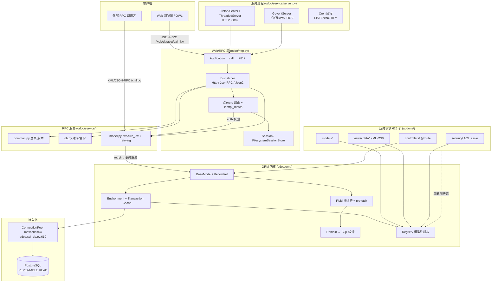
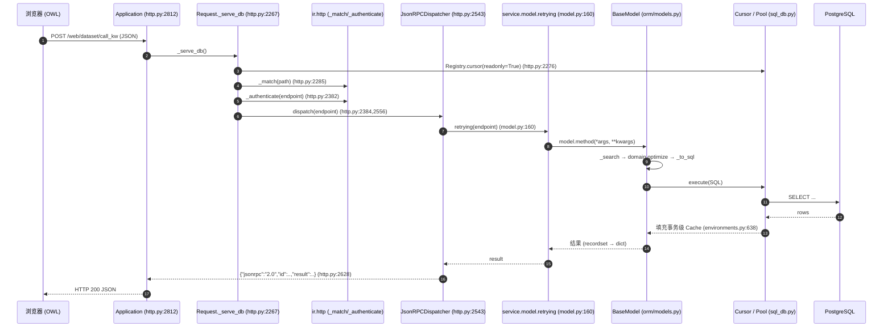
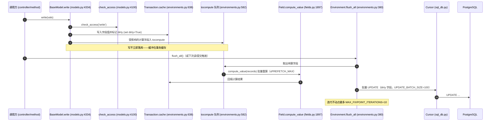
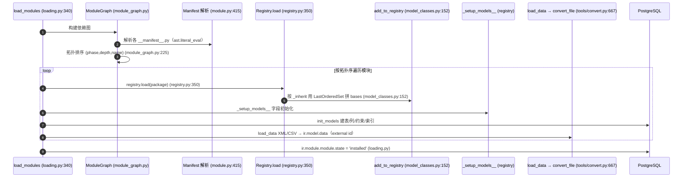

# 项目分析 — Odoo 19.0

**日期**：2026-06-25
**分析人**：Claude（nuclear-fusion / analyzing-codebase）
**仓库**：`/Users/fukai/Downloads/llm_project/git_target/github/odoo-fk`
**分支 / Commit**：`19.0` / `6a84d3e5 [FIX] l10n_fr_pdp: fix ensure_one and due_date`（工作树）
**覆盖范围**：深读框架内核 `odoo/`（约 17.6 万行 Python，含 `odoo/orm/`、`odoo/http.py`、`odoo/service/`、`odoo/modules/`、`odoo/tools/`、`odoo/tests/`、`odoo/sql_db.py`、`odoo/netsvc.py`）；`addons/`（626 个业务模块）按前缀做聚类统计 + 抽样（`base`、`sale` 等），**未逐个深读**；`odoo/addons/`（内置 base/web 等核心模块，约 11.3 万行）抽样；前端 JS/OWL 资产、`debian/`、`setup/` 打包脚本、`doc/` **未深读**。
**输出语言**：中文

> 说明：本报告为只读分析，未修改任何源码（已 `git status` 校验工作树干净）。每个架构论断、风险、流程步骤均附 `file:line` 证据；无法直接核实者标注 **(推断)**。

---

## 1. 执行摘要

Odoo 19.0 是一套成熟的开源 ERP / 企业应用**平台**：底层是一个自研的元数据驱动框架（ORM + 模块系统 + Web/RPC 层），上层是 626 个可插拔业务模块（会计、销售、库存、制造、HR、网站电商、POS 等）。整体规模超百万行 Python（仅框架内核 `odoo/` 即约 17.6 万行；`addons/` 业务层与 `odoo/addons/` 核心层合计远大于此），8500+ Python 文件。架构风格是**模块化单体 + 插件化**：单进程加载，模块通过 `_inherit`/`_inherits` 在运行时把多个模块的同名模型类「拼装」成一个类（MRO 魔法），实现非侵入式扩展。

- **核心优势**：ORM 的元编程扩展机制（`_inherit` 横向扩展）+ 声明式数据/视图/安全（XML/CSV）是 20 年沉淀的成熟范式，第三方可在不改动核心代码的前提下深度定制；ORM 的延迟求值 + prefetch 批处理 + flush 缓冲设计在批量场景下显著降低 SQL 往返。
- **首要风险**：(1) `odoo/orm/models.py` 是 7129 行的「上帝文件」，承载 ORM 绝大部分逻辑，认知与维护成本极高；(2) 运行时类拼装 + `safe_eval` + XML 声明式数据加载带来的隐式耦合与安全面，安全完全依赖 `ir.model.access`(ACL) + `ir.rule`(记录规则) 两层 ORM 内置机制，配置错误即越权。
- **首要亮点**：分层清晰的 ORM 内核（`odoo/orm/` 已从历史的单文件 `models.py` 拆出 fields/domains/registry/environments 等独立模块），且自带性能剖析器（`odoo/tools/profiler.py`）、ormcache 统计（SIGUSR1/2 dump）等可观测能力。

---

## 2. 技术栈

### 2.1 框架内核 / 运行时

| 维度 | 技术 | 版本 | 证据 |
|---|---|---|---|
| 语言 / 运行时 | Python | `>= MIN_PY_VERSION`（3.10+，按 `requirements.txt` 的 `python_version` 分支可至 3.14） | `setup.py` `python_requires`；`ruff.toml:7` target 3.10 |
| Web/WSGI | Werkzeug | 见 `requirements.txt` | `odoo/http.py`（`HTTPRequest`/`Response` 基于 werkzeug） |
| 异步并发（长轮询/WS） | gevent + greenlet | 21.8~24.11（按 py 版本） | `requirements.txt`；`odoo/service/server.py` `GeventServer` |
| 数据库驱动 | psycopg2（PostgreSQL **唯一**支持） | 2.4+ | `odoo/sql_db.py:23` |
| XML / 模板 | lxml | 4.8~6.0（按 py 版本） | `requirements.txt`；`odoo/tools/convert.py` |
| 模板引擎 | Jinja2 + QWeb（自研） | Jinja 3.0~3.1 | `requirements.txt`；QWeb 在 `odoo/addons/base` |
| i18n | Babel | 2.9~2.17 | `requirements.txt` |
| 密码哈希 | passlib `CryptContext`（pbkdf2_sha512, 600k 轮） | — | `odoo/tools/config.py:19,21-23` |
| CSS 预处理 | libsass | 0.20~0.22 | `requirements.txt` |

### 2.2 业务模块层（addons）

| 维度 | 技术 | 证据 |
|---|---|---|
| 模型定义 | 声明式 Python 类（`models.Model` 子类） | `addons/*/models/*.py` |
| 视图 / 数据 | XML（`<record>`/`<template>`）+ CSV | `addons/sale/__manifest__.py`（`data` 段） |
| 安全 | `ir.model.access.csv` + `ir.rule`(XML) + `res.groups` | `addons/sale/__manifest__.py` `security/` 段 |
| 前端 | OWL（自研响应式框架）+ JS/SCSS 资产 | `addons/*/static/src/`（未深读，**推断**） |

### 2.3 工具 / 构建 / 部署

| 维度 | 技术 | 证据 |
|---|---|---|
| Lint | ruff（~30 条规则集，E/F/I/LOG/PLW/RUF/UP 等） | `ruff.toml:12-45` |
| 测试框架 | 自研 unittest 扩展（TransactionCase/HttpCase）+ JS tours | `odoo/tests/common.py` |
| 翻译协作 | Weblate | `.weblate.json`（129KB 配置） |
| 打包 | Debian/RPM/Windows/Wine 脚本 | `setup/`、`debian/` |
| 启动入口 | `odoo-bin` → `odoo/cli/` | `odoo-bin`；`odoo/cli/`（2155 行） |

> CI：`.github/` **仅含** ISSUE_TEMPLATE / PULL_REQUEST_TEMPLATE，**无** workflow YAML（`odoo/service/...` 测试由外部 runbot 体系驱动，仓库内不可见）— 证据：`.github/` 目录列举。

---

## 3. 关键选型分析（vs 主流替代）

### 选型 3.1 — ORM：自研元数据 ORM vs SQLAlchemy / Django ORM

| 维度 | 当前选型（Odoo ORM, `odoo/orm/`） | 替代 A：SQLAlchemy | 替代 B：Django ORM |
|---|---|---|---|
| 名称 | 自研（recordset + Environment + Registry） | SQLAlchemy 2.x | Django ORM |
| 核心优势（针对本项目） | 运行时 `_inherit` 横向拼装模型类，支持「第三方模块非侵入扩展核心模型」这一 Odoo 商业模式的根基；prefetch 组 + flush 缓冲专为批量业务场景优化（`odoo/orm/fields.py:1588` `_to_prefetch`） | 表达力强、SQL 控制精细 | 上手快、生态成熟 |
| 核心劣势（针对本项目） | 与平台强耦合、学习曲线陡、`models.py` 7129 行难维护 | 无运行时类拼装，无法支撑插件化扩展模式 | 迁移/扩展模型需改源码，与 Odoo 插件化目标冲突 |
| 切换成本 | n/a | 极高（重写整个平台） | 极高 |

**推断选型理由**：Odoo 的商业与生态模式（模块市场 + 第三方非侵入扩展）要求「运行时按依赖顺序把多个模块的同名模型合并成一个类」，主流 ORM 均无此能力，故必须自研（`odoo/orm/model_classes.py:152` `add_to_registry` 的 MRO 拼装是不可替代的核心）。

### 选型 3.2 — 数据库：PostgreSQL 独占 vs MySQL / SQLite / 多库抽象

| 维度 | 当前选型 | 替代 A：MySQL | 替代 B：多库抽象层 |
|---|---|---|---|
| 名称 | PostgreSQL（psycopg2, `odoo/sql_db.py:23`） | MySQL/MariaDB | SQLAlchemy Core 多方言 |
| 核心优势 | 深度依赖 PG 特性：JSONB（company-dependent 字段存 JSONB，`odoo/orm/fields.py` condition_to_sql）、REPEATABLE READ 快照隔离（`sql_db.py:373`）、LISTEN/NOTIFY（cron 与缓存信号，`server.py:540`）、savepoint 嵌套事务 | 运维人才多 | 理论可换库 |
| 核心劣势 | 锁定单一数据库 | 缺 JSONB/NOTIFY 等关键特性 | 抽象层削弱 PG 专有优化，性能与功能双输 |
| 切换成本 | n/a | 极高 | 极高 |

**推断选型理由**：ORM 与缓存信号、字段存储均直接依赖 PG 专有能力（JSONB、NOTIFY、savepoint），换库需重写 ORM SQL 层与跨进程信号机制。

### 选型 3.3 — 并发模型：多进程 prefork + 线程 + gevent 三栈混合 vs 纯异步

| 维度 | 当前选型 | 替代 A：纯 asyncio | 替代 B：纯多线程 |
|---|---|---|---|
| 名称 | PreforkServer(进程)+ThreadedServer(线程)+GeventServer(长轮询) | asyncio/ASGI | 纯线程池 |
| 核心优势 | 兼容大量同步阻塞代码（psycopg2、lxml）；CPU 密集任务靠进程隔离（`--workers`），长连接靠 gevent greenlet（`server.py` `GeventServer`） | 单线程高并发 IO | 模型简单 |
| 核心劣势 | 三套并发模型并存，认知与运维复杂（`odoo/service/server.py` 1655 行） | 现存同步代码全部要重写 | GIL 下 CPU 不可扩展，长连接吃线程 |
| 切换成本 | n/a | 极高（生态全同步） | 中 |

**推断选型理由**：历史同步代码 + psycopg2 同步驱动决定无法走纯异步；prefork 解决 GIL/CPU 扩展，gevent 单独承载长轮询/WebSocket（`--gevent-port` 默认 8072，`config.py:261`）。

### 选型 3.4 — 视图/数据声明：XML/CSV 声明式 vs 代码式（迁移脚本/装饰器）

| 维度 | 当前选型 | 替代 A：纯代码定义 | 替代 B：JSON/YAML DSL |
|---|---|---|---|
| 名称 | XML `<record>`/QWeb 模板 + CSV，经 `ir.model.data` 落库 | Python 代码建视图 | 配置式 DSL |
| 核心优势 | 视图/数据可被第三方模块用 XPath 局部 override，无需改 Python；external ID（`module.xml_id`）做跨模块引用与幂等升级（`addons/base/models/ir_model.py` `ir.model.data`） | 类型安全、IDE 友好 | 更轻 |
| 核心劣势 | XML 冗长、运行期才报错、`safe_eval` 安全面 | 无法被非侵入 override | 生态需重建 |
| 切换成本 | n/a | 极高 | 极高 |

**推断选型理由**：与 3.1 同源——非侵入扩展要求视图与数据也能被「叠加 override」，XML + XPath + external ID 是支撑这一点的成熟方案。

### 3.5 未单独对比的选型（一行）
- passlib（密码）/ Babel（i18n）/ ruff（lint）/ libsass — 各自领域有替代但非架构承重点。
- OWL 前端框架 — 自研，但本次未深读前端，略。

---

## 4. 架构与模块分解

### 4.1 架构风格

**模块化单体 + 运行时插件拼装（modular monolith + plugin assembly）**。单进程加载所有已安装模块，模块通过依赖图拓扑排序后依次注册；同名模型类在 Registry 中被合并为单一类。

**证据**：① 模块拓扑加载 `odoo/modules/loading.py:340` `load_modules` + `odoo/modules/module_graph.py:225` 拓扑排序；② 模型类拼装 `odoo/orm/model_classes.py:152` `add_to_registry`（按 `_inherit` 用 `LastOrderedSet` 组装 bases 元组）。

### 4.2 顶层架构图



### 4.3 模块映射（框架内核 `odoo/`）

| 模块/包 | 路径 | 用途 | LOC | 关键入口 `file:line` |
|---|---|---|---|---|
| ORM 内核 | `odoo/orm/` | 模型/字段/环境/域/注册表 | 20,059 | `models.py:334` `class BaseModel` |
| 内置核心模块 | `odoo/addons/` | base/web 等框架自带 addon | 112,870 | `addons/base/__manifest__.py` |
| 工具库 | `odoo/tools/` | 配置/缓存/剖析/转换/i18n 等 | 20,856 | `config.py:157` `configmanager` |
| 测试框架 | `odoo/tests/` | TransactionCase/HttpCase/loader | 5,447 | `common.py:990` `TransactionCase` |
| RPC/服务器 | `odoo/service/` | 三种服务器 + RPC 服务 | 2,548 | `server.py:451` `ThreadedServer` |
| Monkeypatch | `odoo/_monkeypatches/` | 启动期补丁 | 2,852 | `odoo/_monkeypatches/` |
| CLI | `odoo/cli/` | `odoo-bin` 子命令 | 2,155 | `odoo/cli/` |
| 模块系统 | `odoo/modules/` | 清单解析/依赖图/加载 | 2,094 | `loading.py:340` `load_modules` |
| 升级代码 | `odoo/upgrade_code/` | 版本迁移代码改写 | 2,026 | `odoo/upgrade_code/` |
| Web/RPC 层 | `odoo/http.py` | WSGI 入口/路由/会话/分发 | 2,901 | `http.py:2812` `Application.__call__` |
| DB 层 | `odoo/sql_db.py` | Cursor/连接池/savepoint | 852 | `sql_db.py:281` `class Cursor` |
| OSV 兼容 | `odoo/osv/` | 历史兼容层（expression 等） | 477 | `odoo/osv/` |
| 日志 | `odoo/netsvc.py` | 日志初始化/handler/perf | 351 | `netsvc.py:178` `init_logger` |
| 异常 | `odoo/exceptions.py` | UserError/AccessError 等 | 137 | `exceptions.py` |
| 日志级别 | `odoo/loglevels.py` | 伪级别映射 | 112 | `loglevels.py` |

> `odoo/models`、`odoo/fields`、`odoo/api` 为薄转发包（各 ~20-30 行），仅 re-export `odoo/orm/` 的符号，保持历史导入路径 `from odoo import models, fields, api` 兼容。

#### `odoo/orm/` 子文件（拆分后的 ORM 内核，按 LOC）

| 文件 | LOC | 用途 |
|---|---|---|
| `models.py` | 7,129 | BaseModel / Recordset / CRUD（上帝文件） |
| `domains.py` | 2,023 | Domain 表达式与 SQL 编译 |
| `fields.py` | 1,937 | Field 描述符基类、`__get__/__set__`、prefetch |
| `fields_relational.py` | 1,779 | Many2one/One2many/Many2many |
| `registry.py` | 1,249 | 模型注册表、触发器、缓存桶 |
| `fields_properties.py` | 1,063 | company-dependent 属性字段（JSONB） |
| `environments.py` | 964 | Environment / Transaction / Cache |
| `fields_textual.py` | 777 | Char/Text/Html |
| `model_classes.py` | 633 | 模型类拼装（MRO 魔法） |
| 其余 fields_* / commands / utils 等 | ~1,505 | 数值/时间/选择/二进制/命令对象等 |

### 4.4 依赖方向

```
cli / __main__  →  service  →  http  →  orm  →  sql_db  →  PostgreSQL
                                  ↑          ↑
                            modules ──→ registry（加载期写入）
                              tools（被所有层共享：config/cache/profiler）
addons/*  →  odoo.orm（继承 models.Model/Field）+ odoo.http（@route）
```

- **关键反转 / 隐式依赖**：`odoo/http.py` 在 DB 分发时调用 `ir.http`（位于 `odoo/addons/base/models/ir_http.py`）完成 `_match`/`_authenticate`/`_dispatch`（`http.py:2285,2382-2385`）——即**框架层运行期回调到 base 模块层**，这是「框架核心逻辑下沉到可被覆写的 addon」的刻意设计，但造成 http 层与 base 模块的循环式运行期耦合。
- 未观察到 Python import 层面的硬循环（`odoo/orm` 不 import `odoo/addons`），耦合发生在运行期注册表查找而非导入期。

### 4.5 分层

| 层 | 支撑目录 | 可依赖 | 不应依赖 |
|---|---|---|---|
| 表现/接入 | `odoo/http.py`, `odoo/service/`, `addons/*/controllers/` | service, orm | — |
| 应用/服务 | `odoo/service/model.py,db.py,common.py` | orm, sql_db | http 内部细节 |
| 领域/模型 | `odoo/orm/`, `addons/*/models/` | sql_db, tools | http, service |
| 基础设施 | `odoo/sql_db.py`, `odoo/tools/`, `odoo/netsvc.py` | （叶子） | orm, http, service |

### 4.6 横切关注点（详见 §7/§8）

- 日志：`odoo/netsvc.py:178` `init_logger`，含 `PerfFilter` 注入 query 计数/耗时。
- 追踪：无 OpenTelemetry；自带采样式 Profiler（`odoo/tools/profiler.py:83`）。
- 配置：`odoo/tools/config.py:157` `configmanager`（CLI/env/file/默认 多层 ChainMap）。
- 缓存：进程级 `ormcache`（`odoo/tools/cache.py:61`）+ 事务级字段缓存（`environments.py:638` `Cache`）。
- 审计：`ir_logging` 表（`PostgreSQLHandler`）+ mail 模块的 message/tracking（**推断**，未深读）。

---

## 5. 关键功能流程

### 流程 5.1 — Web 客户端 JSON-RPC 调用（`call_kw` 读数据）

- **触发**：浏览器 POST `/web/dataset/call_kw`（type='jsonrpc'）→ `odoo/http.py:2812` `Application.__call__`
- **时序**：



- **端到端路径**：`http.py:2812` `Application.__call__` → `http.py:2267` `_serve_db` → `http.py:2285` `ir.http._match` → `http.py:2382` `_authenticate` → `http.py:2556` `JsonRPCDispatcher.dispatch` → `service/model.py:160` `retrying` → `orm/models.py:1363` `search` / `:3469` `read` → `orm/domains.py:1087` `DomainCondition._to_sql` → `sql_db.py` `Cursor.execute`。
- **数据触达**：业务表 + 事务级字段缓存（`Cache`，`environments.py:638`）+ `ir.model.access`/`ir.rule` 权限校验。
- **副作用**：读路径使用只读游标（`readonly=True`，`http.py:2276`），无写。
- **幂等性**：读操作天然幂等。
- **时延预算**：未文档化；`--limit-time-real` 默认 120s 为硬上限（`config.py:485`）。

### 流程 5.2 — ORM 写入与 flush（`write` + 计算字段重算）

- **触发**：`record.write(vals)` → `odoo/orm/models.py:4334`
- **时序**：



- **端到端路径**：`models.py:4334` `write` → `models.py:4100` `check_access` → 写事务缓存并打 dirty（`environments.py:715` `Cache.set`）→ 入 `tocompute`（`environments.py:582`）→ `environments.py:380` `flush_all` → `fields.py:1897` `compute_value` 批量重算 → `sql_db.py` 批量 UPDATE。
- **数据触达**：业务表 + 事务缓存 + dirty 标记集 + 计算依赖触发链（`@api.depends`，`orm/decorators.py:244`）。
- **副作用**：DB UPDATE；触发 `@api.constrains` 校验（`decorators.py:88`）；触发 inverse 字段写。
- **幂等性**：`write` 本身非幂等（覆盖式）；flush 通过 dirty 集合去重，避免重复 UPDATE。
- **时延预算**：未文档化。

### 流程 5.3 — 启动期模块加载与注册表拼装

- **触发**：`odoo-bin`/升级 → `odoo/modules/loading.py:340` `load_modules`
- **时序**：



- **端到端路径**：`loading.py:340` `load_modules` → `module_graph.py:225` 拓扑排序 → `module.py:415` 清单解析 → `registry.py:350` `Registry.load` → `model_classes.py:152` `add_to_registry`（`_inherit` 拼装）→ `tools/convert.py:667` `convert_file` 落 `ir.model.data`。
- **数据触达**：`ir_module_module`、`ir_model`/`ir_model_data`/`ir_model_fields`、所有业务表 DDL。
- **副作用**：建表/改列/建约束、安装 Python 模块、写 external ID、执行 pre/post_init_hook。
- **幂等性**：升级路径靠 `ir.model.data` 的 external ID + `noupdate` 标志实现幂等更新（`addons/base/models/ir_model.py` `ir.model.data`）。

### 流程 5.4 — 外部 XML/JSON-RPC `execute_kw`（集成路径，散文）

外部系统调用 `/xmlrpc/2/object` 或 JSON-RPC `object.execute_kw(db, uid, password, model, method, args, kwargs)` → `odoo/http.py:428` `dispatch_rpc` → `odoo/service/model.py:109` `model.dispatch` →`:132` `_check_uid_passwd(uid, passwd)` 鉴权 → `:160` `retrying` 包裹（捕获 `IntegrityError`/`OperationalError`/`ConcurrencyError`，最多重试 5 次，指数退避 `random.uniform(0, 2**tryno)`，`model.py:226`）→ 反射调用模型方法。与 5.1 共用 ORM 与 `retrying`，区别在鉴权用 `uid+password`（无 session）。

### 流程 5.5 — Cron 定时任务（散文）

`PreforkServer`/`ThreadedServer` 启动 cron 线程（`server.py:519` `cron_thread`，默认 `--max-cron-threads=2`，`config.py:441`），通过 PostgreSQL `LISTEN/NOTIFY`（`server.py:540`）唤醒，按 `ir.cron` 记录到期触发；每 worker 加 jitter 抖动（`server.py:549`）缓解惊群，空闲 `SLEEP_INTERVAL=60s`（`server.py:68`）。

---

## 6. API 表面与消息结构

### 6.1 路由 / RPC / CLI 清单

| 类别 | 路径 / RPC / CLI | 方法 | 处理入口 `file:line` | 鉴权 |
|---|---|---|---|---|
| Web JSON-RPC | `/web/dataset/call_kw` 等（业务 controller 海量，按模块分组） | POST(jsonrpc) | `JsonRPCDispatcher` `http.py:2543` | `user` |
| HTTP 路由 | `addons/*/controllers/*.py` 的 `@route` | GET/POST | `HttpDispatcher` `http.py:2472` | `user`/`public`/`none` |
| 静态资源 | `/<module>/static/<path>` | GET | `_serve_static` `http.py:2219` | none |
| 外部对象 RPC | `object.execute_kw` | RPC | `service/model.py:109` `dispatch` | uid+pwd |
| 公共服务 RPC | `common.login/version/about` | RPC | `service/common.py:56` | 视方法 |
| 数据库 RPC | `db.create/list/dump/restore` | RPC | `service/db.py:510` | 主密码 |
| CLI | `odoo-bin <cmd>` | — | `odoo/cli/` | OS |

> 业务路由总数随已安装模块动态生成（`http.py:849` `_generate_routing_rules`），不在框架层枚举；上表给出**协议分组**，每组对应一个 Dispatcher。

### 6.2 / 6.3 请求 & 响应 Schema（头部路由）

- **`/web/dataset/call_kw`（JSON-RPC）**
  - 请求体形状：`{"jsonrpc":"2.0","method":"call","params":{"model","method","args","kwargs"},"id":N}`，其中 `params` **必须是 JSON Object**（Odoo 对 JSON-RPC 的偏离，`http.py:2543` 注释）。`params.context` 可覆写 session context（`JsonRPCDispatcher.dispatch`）。
  - 响应体：成功 `{"jsonrpc":"2.0","id":N,"result":<任意>}`；失败见 §6.5。构造点 `http.py:2628` `_response`。状态码：恒 200（错误也包在 200 的 envelope 里）。
- **`object.execute_kw`（XML/JSON-RPC）**
  - 参数：`(db, uid, password, model, method, args=[], kwargs={})`，`service/model.py:109`。
  - 响应：方法返回值直接序列化。

### 6.4 流式格式

- 长轮询 / WebSocket 由 `GeventServer`（`:8072`）承载（bus 模块，**推断**，未深读）；核心 HTTP 层无 SSE。

### 6.5 错误模型

| 异常 | 父类 | 典型 HTTP 映射 | `file:line` |
|---|---|---|---|
| `UserError` | `exceptions` | 422 Unprocessable | `http.py:2534-2538` |
| `AccessError` | `UserError` 体系 | 403/封装 | `odoo/exceptions.py` |
| `AccessDenied` | — | 鉴权失败 | `odoo/exceptions.py` |
| `SessionExpiredException` | — | 重定向 /web/login | `http.py:2525`（HTTP）/ code=100（JSON-RPC `:2614`） |
| `NotFound`(werkzeug) | — | 404 / code=404 | `http.py` JsonRPC 分支 |
| `ValidationError` | `UserError` 体系 | 422 | `exceptions.py`（`@api.constrains` 抛出） |

**线级错误信封（JSON-RPC，`http.py:2614-2618` + `serialize_exception` `:469`）**：
```json
{
  "jsonrpc": "2.0",
  "id": 1,
  "error": {
    "code": 200,
    "message": "Odoo Server Error",
    "data": {
      "name": "odoo.exceptions.UserError",
      "message": "<人类可读消息>",
      "arguments": ["..."],
      "context": {},
      "debug": "<traceback 字符串>"
    }
  }
}
```
**可重试性**：`service/model.py:160` `retrying` 对 `IntegrityError`/`OperationalError`/序列化失败做事务级重试（最多 5 次，指数退避 `:226`）；业务 `UserError` 不重试。

### 6.6 自定义头 / 元数据契约

| 头 / 字段 | 方向 | 用途 | `file:line` |
|---|---|---|---|
| `X-CSRF-Token`（表单 csrf_token） | 请求 | 非安全方法 CSRF 校验 | `http.py:1934` `csrf_token` / `:2493` 校验 |
| `Authorization: Bearer <token>` | 请求 | `auth='bearer'` 无状态鉴权 | `http.py:773-789` |
| Session Cookie（sid，84 字符 base64） | 双向 | 会话标识 | `http.py:1077` `generate_key` |

### 6.7 契约文档

- 无 OpenAPI/AsyncAPI/proto；API 即「模型方法签名」，由 `ir.model`/`ir.model.fields` 在运行时自描述（ORM 反射），外部开发参考官方文档而非生成式 schema。

---

## 7. 性能与可靠性设计

### 7.1 并发模型
- 三栈：`ThreadedServer`（`server.py:451`，HTTP 线程，信号量限流 `ODOO_MAX_HTTP_THREADS`，默认 `(db_maxconn - max_cron_threads)/2`，`:258`）；`GeventServer`（长轮询/WS greenlet，`:8072`）；`PreforkServer`（`--workers`，POSIX 多进程，默认 0=禁用，`config.py:459`）。
- Cron：`server.py:519` `cron_thread`，PG LISTEN/NOTIFY 唤醒（`:540`）。
- 线程局部：`server.py:72` `thread_local`（`rpc_model_method`/`query_count`/`query_time` 等）。

### 7.2 连接池 / 客户端池

| 池/缓存 | 类 | 后端 | 作用域 | 默认大小/TTL | `file:line` |
|---|---|---|---|---|---|
| DB 连接池 | `ConnectionPool` | psycopg2 | 进程 | `maxconn=64`；空闲 `MAX_IDLE_TIMEOUT=600s` | `sql_db.py:610`；`:84`；`config.py:390` |
| gevent 专用池 | 同上 | psycopg2 | gevent 进程 | `--db-maxconn-gevent`（可空） | `config.py:392` |
| 游标级缓存 | `BaseCursor.cache` dict | 内存 | 单请求 | 关闭即清（`sql_db.py:534`） | `sql_db.py:170` |

**生命周期**：`borrow()`（`:641`）取连接含空闲清理 + GC；`give_back()`（`:708`）归还；`close_all()`（`:726`）。游标提交链：`commit()`（`:560`）= flush→DB commit→clear→postcommit；`rollback()`（`:570`）= clear→prerollback→DB rollback→postrollback。

### 7.3 缓存层

| 层 | 后端 | 作用 | TTL | `file:line` |
|---|---|---|---|---|
| 进程级 LRU | `LRU`（RLock，无锁读） | `@ormcache` 方法结果缓存 | 容量上限驱逐（无时间 TTL） | `tools/lru.py:13`；`tools/cache.py:61` |
| 事务级字段缓存 | dict `{field→{id→value}}` | recordset 字段值 | 事务结束失效 | `environments.py:638` `Cache` |
| 注册表缓存桶 | `Registry.__caches` | 按 cache 名分桶 | 跨进程靠信号失效 | `tools/cache.py:104,127` |

**跨进程失效**：无 Redis；ormcache 为**进程内**缓存，多 worker 间靠注册表信号（PG NOTIFY / `base_registry_signaling` 序列，**推断**机制）协调失效。`SIGUSR1/2` 可 dump 缓存命中统计（`tools/cache.py:316,320`）。

### 7.4 重试 / 超时 / 退避

| 机制 | 默认 | `file:line` |
|---|---|---|
| 事务重试次数 | `MAX_TRIES_ON_CONCURRENCY_FAILURE`（5） | `service/model.py:160` |
| 退避 | `random.uniform(0, 2**tryno)` 指数 | `service/model.py:226` |
| 计算字段不动点迭代 | `MAX_FIXPOINT_ITERATIONS=10` | `environments.py:380` `flush_all` |
| 请求实时超时 | `--limit-time-real` 120s | `config.py:485` |
| CPU 超时 | `--limit-time-cpu` 60s（POSIX） | `config.py:482` |
| 内存软/硬限 | 2048/2560 MiB | `config.py:462,472` |

> 未观察到独立的熔断器/限流器组件——限流体现在 HTTP 线程信号量与 worker/内存/时间硬限上，**业务级 rate-limit 不在框架核心**（可能在 base 模块或反代层，**推断**）。

### 7.5 限流
- 框架层无独立速率限制器；以**资源硬限**替代：HTTP 线程信号量（`server.py:250`）、`--workers`、`limit_memory_*`、`limit_time_*`（`config.py:459-485`）。`auth='bearer'`/登录失败计数等业务级限流位于 base 模块（**推断**）。

### 7.6 批处理 / 队列 / 背压
- ORM 写缓冲：`write` 不立即落库，缓冲在事务缓存 + `tocompute`，到 `flush_all` 批量 UPDATE（`UPDATE_BATCH_SIZE=100`）/INSERT（`INSERT_BATCH_SIZE=100`）；`unlink` 用 `split_every` 分批 DELETE（`models.py:4232`）。
- Cron 作为异步任务队列（`ir.cron` + LISTEN/NOTIFY）。

### 7.7 DB 性能约束
- N+1 规避：prefetch 组（`fields.py:1588` `_to_prefetch`，按 `prefetch` 分组，批量上限 `PREFETCH_MAX`）。
- 分页：`search(offset, limit, order)`（`models.py:1363`），Query 惰性求值（`_search` 返回未执行 Query，`models.py:5324`）。
- 隔离级别：REPEATABLE READ 快照（`sql_db.py:373`）。

### 7.8 冷启动 / 启动优化
- 模块按拓扑序惰性加载；薄转发包（`odoo/models`/`fields`/`api`）减少导入开销；`_monkeypatches/`（2852 行）在启动期打补丁。

### 7.9 声明的基线指标
- 仓库未给出 RPS/时延基线数字（无 benchmark 目录、无 CI badge）。可观测的「容量旋钮」仅为 `config.py` 的 workers/limit_* 默认值。

---

## 8. 监控、告警与审计

### 8.1 指标清单
- **无 Prometheus / 无独立 metrics exporter**。可观测性以**结构化日志 + 按需剖析**为主：
  - `PerfFilter`（`netsvc.py:113`）向每条日志注入 `perf_info`：query 数、query 耗时(ms)、剩余时间、游标模式(ro/rw)（`:127-130`）。
  - `ormcache` 计数器 `ormcache_counter`（hit/miss/err/gen_time/tx_hit/tx_miss/tx_err，`cache.py:30`），`SIGUSR1`→统计、`SIGUSR2`→含内存大小（`cache.py:316,320`）。
  - SQL 慢查询：`sql_db.py:447-475` 按表分类记录 query 计数/耗时（debug 级）。

> 该项目无「≥15 个命名指标」的指标目录——其遥测模型是**日志字段 + 信号触发的剖析快照**，而非时序指标。如实标注：**N/A — 无 metrics 系统**。

### 8.2 追踪
- 无 OpenTelemetry/Jaeger/Datadog 集成。替代为**采样式 Profiler**：`tools/profiler.py:83` `Collector`，栈采样 `_get_stack_trace`（`:144`），可限制 `entry_count_limit`/`time_limit`（`:134`），线程局部执行上下文（`:124`）。

### 8.3 审计
- `ir_logging` 表（`PostgreSQLHandler`，`netsvc.py:46`）：写入 create_date/type/dbname/logger/level/message/path/line/func/metadata，`statement_timeout=1000ms` 防死锁（`:67`）。
- 业务审计（字段变更追踪 `mail.tracking`、chatter）位于 mail 模块（**推断**，未深读）。
- 不可变性：`ir_logging` 为追加写普通表，**无 WORM/hash-chain**。

### 8.4 告警
- 框架层**无内置告警系统**（无 AlertType 枚举、无 Slack/PagerDuty 路由）。告警依赖外部日志聚合（syslog handler，`netsvc.py:237`）或 base/mail 模块的邮件通知（**推断**）。如实标注：**N/A — 框架核心无告警枚举**。

### 8.5 遥测保留
| 信号 | 保留 | 来源 |
|---|---|---|
| 日志 | 由 handler/外部决定（stderr/file/syslog/`ir_logging`） | `netsvc.py:234-289` |
| 指标 | N/A | — |
| 追踪 | 按需剖析，不持久化 | `tools/profiler.py` |

---

## 9. 关键技术与横切模式

- **运行时模型类拼装（MRO 魔法）** — `odoo/orm/model_classes.py:152` — Odoo 最核心的元编程：把多个模块的同名模型类按依赖顺序合并成单一类，是「非侵入扩展」的根基。
- **声明式 ORM + 描述符字段** — `odoo/orm/fields.py:92` `class Field` — `__get__/__set__`（`:1642/:1807`）实现延迟求值、prefetch、计算/related 字段。
- **Environment / Transaction / Cache 三件套** — `odoo/orm/environments.py:40/552/638` — 承载 `(cr, uid, context)` 上下文、事务级缓存、dirty 追踪、待算队列。
- **Domain → SQL 编译器** — `odoo/orm/domains.py:196` `class Domain` — 多态域树（And/Or/Not/Condition）+ 优化器（`OptimizationLevel`，`:176`）+ `_to_sql`。
- **`@api.*` 装饰器族** — `odoo/orm/decorators.py`：`depends`(244)/`constrains`(88)/`onchange`(185)/`ondelete`(126)/`model`(309)/`autovacuum`(295)/`readonly`(341)/`private`(324)。
- **external ID（`module.xml_id`）** — `ir.model.data`（`addons/base/models/ir_model.py`）— 跨模块引用 + 幂等升级的全局命名空间。
- **`safe_eval`** — `odoo/tools/safe_eval.py` — 受限 Python 求值，用于域/字段/视图表达式（既是能力也是安全面）。
- **`ir.http` 运行期回调** — 框架 http 层把 `_match/_authenticate/_dispatch` 下沉到可覆写的 base 模块（`http.py:2285-2385`）。
- **三服务器并发模型** — `odoo/service/server.py`（见 §7.1）。

---

## 10. 风险与问题

### 10.1 严重（Critical）
| ID | 问题 | 证据 | 影响 | 修复方向 |
|---|---|---|---|---|
| C1 | 安全完全依赖两层 ORM 机制（ACL + 记录规则），任一配置遗漏即越权 | `orm/models.py:4100` `check_access` / `:4162` `:4176` | 模块若漏配 `ir.model.access.csv` 或 `ir.rule`，可造成跨租户/越权读写 | 对每个新模型强制 ACL 覆盖检查（CI lint 规则）；安全评审清单纳入 release gate（交 `reviewing-code`） |
| C2 | `safe_eval` + XML 声明式数据加载构成动态执行面 | `tools/safe_eval.py`；`tools/convert.py:667` | 恶意/错误模块的表达式或数据文件可能触发非预期执行 | 审计第三方模块的 eval 表达式与 data 文件来源；限制可安装模块来源 |

> 注：C1/C2 是**平台固有设计权衡**而非缺陷，列为 Critical 是提示「运维与模块开发须按此约束严格执行」。

### 10.2 高（High）
| ID | 问题 | 证据 | 影响 | 修复方向 |
|---|---|---|---|---|
| H1 | `odoo/orm/models.py` 7129 行上帝文件 | `orm/models.py`（CRUD/search/access/fetch 全在内） | 认知负荷极高、改动易引入回归、评审困难 | 已部分拆分（fields/domains/environments 已独立）；可继续按职责切出 access/crud/fetch 子模块（交 `designing-solution`） |
| H2 | http 层与 base 模块运行期循环耦合 | `http.py:2285-2385` 调 `ir.http` | 框架与业务模块边界模糊，单测需起注册表 | 文档化该回调契约；为 `ir.http` 钩子加接口测试 |
| H3 | 无内置指标/告警/分布式追踪 | §8.1/8.4 N/A | 生产可观测性依赖外部栈搭建，开箱即用度低 | 评估接入 OTel/Prometheus exporter（交 `building-production-feature`） |
| H4 | 仓库内无 CI workflow | `.github/` 仅模板 | 贡献者本地无法复现门禁，质量门依赖外部 runbot | 补最小 GitHub Actions（ruff + 冒烟测试）（交 `quick-coding`） |

### 10.3 中（Medium）
| ID | 问题 | 证据 | 影响 | 修复方向 |
|---|---|---|---|---|
| M1 | ormcache 仅进程级、跨 worker 靠信号失效 | `tools/cache.py:61` | 多 worker 下缓存一致性依赖信号正确性，调试困难 | 文档化失效信号路径；为缓存失效加可观测计数 |
| M2 | RPC 错误信封 `debug` 字段含完整 traceback | `http.py:469` `serialize_exception` | 非 dev 模式若泄漏会暴露内部结构 | 确认生产模式下 `debug` 字段被裁剪 |
| M3 | l10n_* 占 35%（221 个） | `addons/l10n_*` | 本地化模块体量巨大，质量参差，维护分散 | 按地区分组治理，明确 owner |

### 10.4 低 / 信息（Low / Info）
- `odoo/osv/`（477 行）为历史兼容层，新代码应用 `odoo/orm/domains.py` 替代（`odoo/osv/`）。
- `requirements.txt` 按 `python_version` 大量分支 pin，维护成本高但属发行版兼容必需。
- `odoo/models`/`fields`/`api` 薄转发包易让新人误以为逻辑在此（实际在 `odoo/orm/`）。

---

## 11. 亮点（值得保留）

- **ORM 内核分层拆分** — `odoo/orm/` — 已从历史单文件 `models.py` 拆出 fields/domains/registry/environments/model_classes，职责边界清晰，是大型遗留系统持续重构的正面样本。
- **延迟求值 + prefetch + flush 缓冲** — `fields.py:1588`、`environments.py:380` — 批量业务下大幅削减 SQL 往返，是 ORM 性能的核心设计。
- **自带性能剖析与缓存统计** — `tools/profiler.py:83`、`tools/cache.py:316` — 在无外部 APM 时仍可定位热点（栈采样 + SIGUSR dump）。
- **声明式扩展生态** — `_inherit`/external ID/XPath override — 支撑了 20 年的第三方模块市场，工程上证明可扩展。
- **事务可靠性** — `service/model.py:160` `retrying` + savepoint（`sql_db.py:87`）+ REPEATABLE READ，对并发冲突有系统性应对。

---

## 12. 待澄清问题（交项目方）

1. 本次分析目标是**整个 Odoo 平台**，还是聚焦最近改动的 `l10n_fr_pdp`（法国电子发票 PDP）模块？若是后者，应另起一份针对该 addon 的聚焦分析。
2. 生产部署形态？（单机 ThreadedServer / 多进程 Prefork / 是否启用 gevent 长轮询）—— 决定 §7 哪条并发路径是主路径。
3. 是否有外部可观测性栈（ELK/Prometheus/OTel）承接日志与剖析？—— 决定 H3 优先级。
4. 是否使用 Odoo 官方版还是有自研补丁分支？`_monkeypatches/` 是否含本地定制？
5. 前端 OWL/JS 资产是否在本次分析范围内（本报告未深读）？

---

## 13. 建议的下一步（含子能力交接）

- [ ] **(交 `expert-consulting`)** 先与项目方确认分析目标（整平台 vs `l10n_fr_pdp`），避免范围错配——见 §12 Q1。
- [ ] **(交 `quick-coding`)** 补最小 CI（`.github/workflows`：ruff + 冒烟），让贡献者本地可复现门禁——对应 H4。
- [ ] **(交 `reviewing-code`)** 对新增/改动模块做「ACL + ir.rule 覆盖完整性」专项评审，落实 C1 约束。
- [ ] **(交 `designing-solution`)** 评估 `orm/models.py` 上帝文件的进一步职责拆分方案（access/crud/fetch）——对应 H1。
- [ ] **(交 `building-production-feature`)** 若生产需要，设计接入 OpenTelemetry/Prometheus 的可观测层——对应 H3。

---

**范围诚实声明**：本报告深读了框架内核 `odoo/`（ORM/http/service/modules/tools/tests/sql_db/netsvc，约 17.6 万行），对 626 个 `addons/` 业务模块仅做前缀聚类统计 + `base`/`sale` 抽样，**未逐模块深读**；`odoo/addons/`（base/web 等内置模块，约 11.3 万行）仅抽样；前端 OWL/JS/SCSS 资产、`debian/`/`setup/` 打包、`doc/`、`upgrade/`、各 l10n 模块**均未审阅**。标注 **(推断)** 处未经源码直接核实。涉及 base 模块的运行期机制（`ir.http`/`ir.model.data`/`res.users` 鉴权）仅核实了入口与关键行，未通读其实现。
